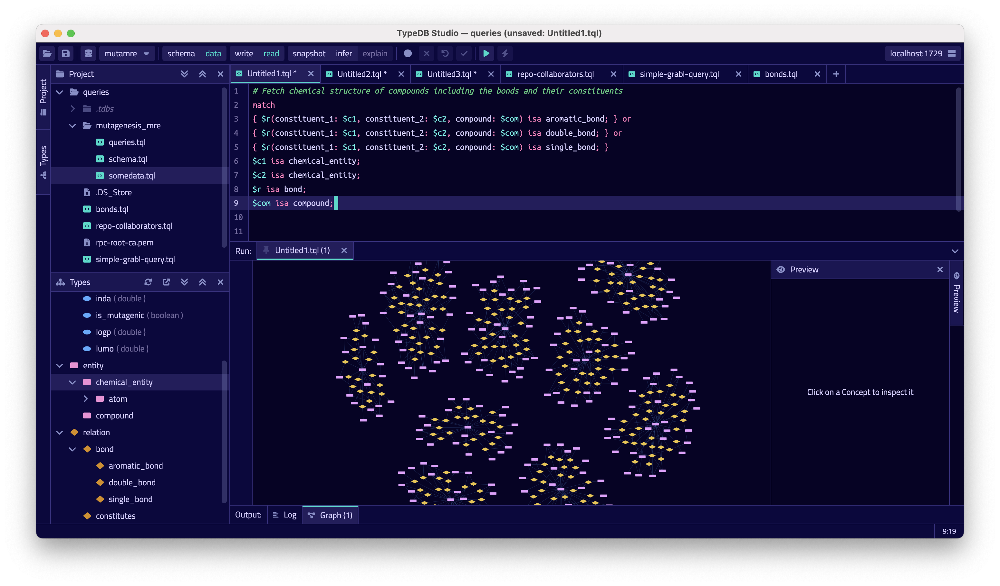
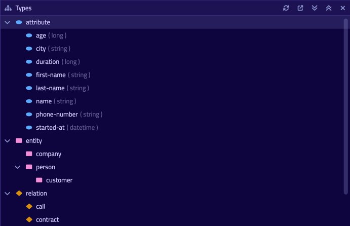
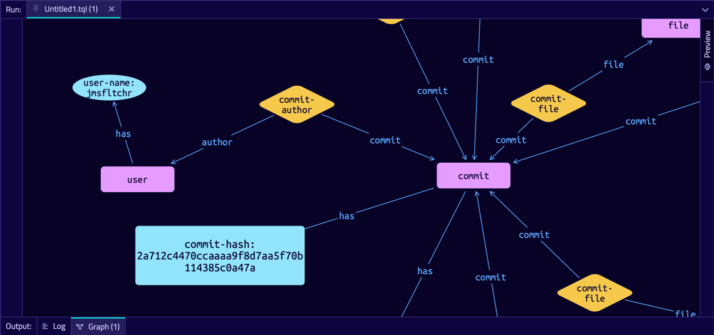
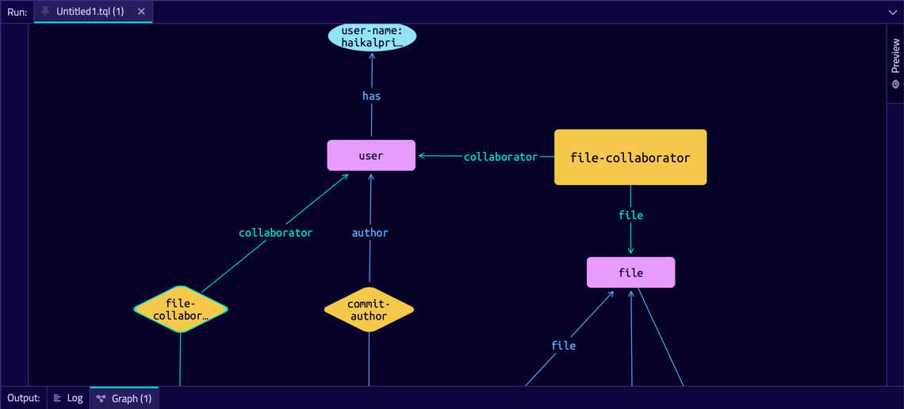

[](https://factory.vaticle.com/vaticle/typedb-studio)
[](https://vaticle.com/discord)
[](https://forum.vaticle.com)
[](https://stackoverflow.com/questions/tagged/typedb)
[](https://stackoverflow.com/questions/tagged/typeql)

## TypeDB Studio

[](./images/studio_full_1.png)

TypeDB Studio is a fully-featured Integrated Development Environment (IDE) for TypeDB.

You can utilise Studio as you would [TypeDB Console](https://docs.vaticle.com/docs/console/console)
and the [TypeDB Clients](https://docs.vaticle.com/docs/client-api/overview): to connect to your TypeDB instance and perform
queries.

Studio is an IDE designed for the end-to-end development of TypeDB databases, database queries, and data exploration,
via a clean and intuitive UI that gives you a top-down view of your entire database.

## Usage

### Connect to TypeDB

Upon launching Studio, you'll be asked for your TypeDB server details and to choose or create a database.

### Manage TypeDB Projects

After connecting to TypeDB and selecting a database, Studio will prompt you to open (or create) a project directory.
This is where Studio will load and save query files, but you can also freely edit text files in the project directory
using Studio. The project browser maintains a live view of the directory contents on the filesystem.

### Manage Database Schemas

[](./images/type_browser_1.png)

The Type Browser provides a structured tree view of the connected database's type hierarchy. Double-clicking on any of 
the listed types will bring up a page that lists their properties in detail — supertype, roles played, attributes owned
and more.

### Run TypeQL Queries

[](./images/log_output_1.png)

Studio's text editor comes equipped with rich developer tooling, like syntax highlighting
for TypeQL files (\*.tql), with more advanced features currently under development. Studio's intuitive and
self-explanatory interface enables a rapid, iterative workflow.

TypeDB Studio brings session and transaction configuration to the forefront, providing greater visibility to the user
about the state of the system. Studio allows you to run any TypeQL query, pretty-printing results
to the Log Output window which is easily searchable (and supports regex matching.)

### Graph Visualisation

[](./images/graph_vis_1.png)

Reasoning about text outputs in [TypeDB Console](https://docs.vaticle.com/docs/console/console) or through
the various [TypeDB Clients](https://docs.vaticle.com/docs/client-api/overview) can be difficult to do for large
datasets. Studio's advanced force-graph visualisation makes the underlying structure of data immediately apparent.

### Reasoning and Explanations

[](./images/infer_vis_1.png)

Select infer and explain, then double-click highlighted inferred concepts to retrieve their explanations and visualise
how the fact was inferred.

## Download TypeDB Studio

You can download TypeDB Studio from the [Download Centre](https://vaticle.com/download#typedb-studio)
or [GitHub Releases](https://github.com/vaticle/typedb-studio/releases).

## Developer Resources

- Documentation: https://docs.vaticle.com
- Discussion Forum: https://forum.vaticle.com
- Discord Chat Server: https://vaticle.com/discord
- Community Projects: https://github.com/typedb-osi

## Compiling and Running TypeDB Studio from Source

> Note: You **DO NOT NEED** to compile TypeDB Studio _"from source"_ if you just want to use TypeDB Studio. You can
> simply download TypeDB Studio following the section above.

1. Make sure you have the following dependencies installed on your machine:
    - Java JDK 11 or higher
    - [Bazel 5 or higher](http://bazel.build/). We use [Bazelisk](https://github.com/bazelbuild/bazelisk) to manage
      multiple Bazel versions transparently. Bazelisk runs the appropriate Bazel version for any `bazel` command as
      specified in [`.bazelversion`](https://github.com/vaticle/typedb/blob/master/.bazelversion) file. In order to
      install it, follow the platform-specific guide:
        - MacOS: `brew install bazelbuild/tap/bazelisk`
        -
      Linux: `wget https://github.com/bazelbuild/bazelisk/releases/download/v1.4.0/bazelisk-linux-amd64 -O /usr/local/bin/bazel`

2. Depending on your Operating System, you can compile and run TypeDB Studio with either one of the following commands.
   ```sh
   $ bazel run //:studio-bin-mac
   ```
   ```sh
   $ bazel run //:studio-bin-windows
   ```
   ```sh
   $ bazel run //:studio-bin-linux
   ```
   You can also replace `run` with `build` in the command above, and Bazel will simply produce the JAR for TypeDB Studio
   under `bazel-bin/studio-bin-<mac|windows|linux>.jar`.

## Contributions

TypeDB Studio has been built using various open-source frameworks throughout its evolution. Today TypeDB Studio is built
using [Kotlin](https://kotlinlang.org), [Compose Multiplatform](https://github.com/JetBrains/compose-jb),
and [Bazel](https://bazel.build). Thank you to the developers!

## Licensing

This software is developed by [Vaticle](https://vaticle.com/). It's released under the GNU Affero GENERAL PUBLIC
LICENSE, Version 3, 19 November 2007. For license information, please
see [LICENSE](https://github.com/vaticle/typedb-studio/blob/master/LICENSE). Vaticle also provides a commercial license
for TypeDB Studio - get in touch with our team at commercial@vaticle.com.

Copyright (C) 2022 Vaticle
