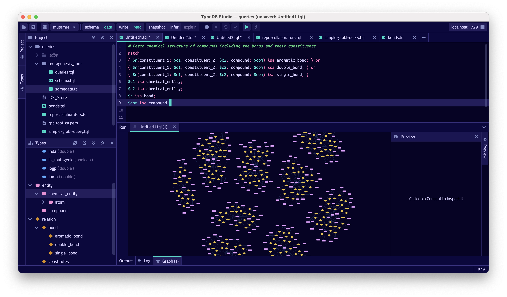
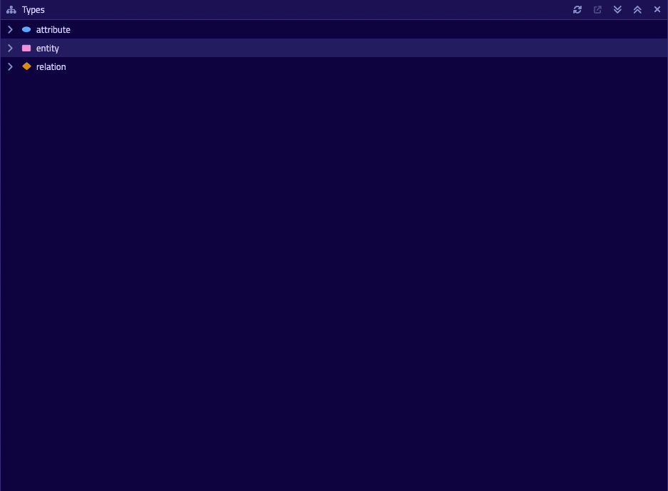
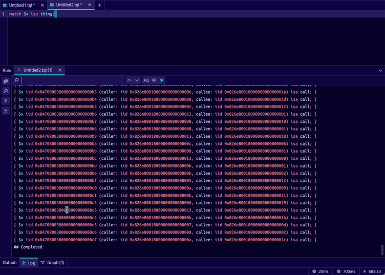
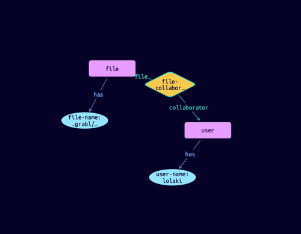

[](https://factory.vaticle.com/vaticle/typedb-studio)
[](https://typedb.com/discord)
[](https://forum.typedb.com)
[](https://stackoverflow.com/questions/tagged/typedb)
[](https://stackoverflow.com/questions/tagged/typeql)

* [TypeDB Studio](#typedb-studio)
* [Usage](#usage)
* [Download TypeDB Studio](#download-typedb-studio)
* [Developer resources](#developer-resources)
* [Compiling from source](#compiling-and-running-typedb-studio-from-source)
* [Contributions](#contributions)
* [Licensing](#licensing)

## TypeDB Studio

[](./docs/images/studio-full-1.png)

TypeDB Studio is an Integrated Development Environment (IDE)
that facilitates the development process for TypeDB databases.
It provides a consistent experience across different operating systems, including Windows, macOS, and Linux.
With TypeDB Studio, developers can efficiently manage databases,
execute queries, and explore query results all within a unified environment.

One of the key features of TypeDB Studio is its interactive visualizer,
which allows developers to visualize query results and explore inferred data.
The visualizer presents data in a hypergraph format,
making it easy to navigate and understand the relationships between entities and attributes.

TypeDB Studio also includes a schema manager with a graphical interface,
making it convenient for developers to edit, visualize, and maintain their data models.
The user-friendly interface simplifies the process of creating, extending, exploring,
and managing schemas, enabling developers to easily define the structure and relationships of their data.

TypeDB Studio offers a clean and intuitive UI for various tasks related to TypeDB databases.
Developers can effortlessly create and delete databases, build and extend schemas, and define or undefine rules.
TypeDB Studio also enables efficient data management by providing functionality to insert, modify,
and query data directly within the IDE.
This feature is particularly useful in production environments,
as it allows developers to quickly address issues and make data-related changes.

Key features of TypeDB Studio include:

- Graphical interface for creating or establishing a connection with a TypeDB database, eliminating the need for command line tools or client libraries.
- Built-in syntax highlighting for TypeQL and pop-up notifications for warnings and error messages that may occur during runtime/query execution.
- Local syntax validation against a set of basic checks before sending instructions and queries to the server.
- Concept browser for exploring data models, including detailed views of entities, relations, attributes, and their interactions.
- Graph visualization engine for visualizing query results using user-modifiable, force-directed graph drawings.

## Usage

### Connect to TypeDB

Upon launching Studio, you'll be asked for your TypeDB server details and to choose or create a database.

### Manage TypeDB Projects

After connecting to TypeDB and selecting a database, Studio will prompt you to open (or create) a project directory.
This is where Studio will load and save query files, but you can also freely edit text files in the project directory
using Studio. The project browser maintains a live view of the directory contents on the filesystem.

### Manage Database Schemas

[](./docs/images/type-browser-1.gif)

The Type Browser provides a structured tree view of the connected database's type hierarchy. Double-clicking on any of
the listed types will bring up a page that lists their properties in detail — supertype, roles played, attributes owned
and more.

### Run TypeQL Queries

[](./docs/images/log-output-1.gif)

Studio's text editor comes equipped with rich developer tooling, like syntax highlighting
for TypeQL files (\*.tql), with more advanced features currently under development. Studio's intuitive and
self-explanatory interface enables a rapid, iterative workflow.

TypeDB Studio brings session and transaction configuration to the forefront, providing greater visibility to the user
about the state of the system. Studio allows you to run any TypeQL query, pretty-printing results
to the Log Output window which is easily searchable (and supports regex matching.)

### Graph Visualisation

[](./docs/images/graph-vis-1.gif)

Reasoning about text outputs in [TypeDB Console](https://docs.typedb.com/docs/console/console) or through
the various [TypeDB Drivers](https://docs.typedb.com/docs/driver-api/overview) can be difficult to do for large
datasets. Studio's advanced force-graph visualisation makes the underlying structure of data immediately apparent.

### Reasoning and Explanations

[](./docs/images/infer-vis-1.gif)

Select infer and explain, then double-click highlighted inferred concepts to retrieve their explanations and visualise
how the fact was inferred.

## Download TypeDB Studio

You can download TypeDB Studio from the [GitHub Releases](https://github.com/vaticle/typedb-studio/releases).

## Developer Resources

- Documentation: https://docs.typedb.com
- Discussion Forum: https://forum.typedb.com
- Discord Chat Server: https://typedb.com/discord
- Community Projects: https://github.com/typedb-osi

## Compiling and Running TypeDB Studio from Source

> Note: You **DO NOT NEED** to compile TypeDB Studio from source if you just want to use TypeDB Studio. You can
> simply download TypeDB Studio following the _"Download TypeDB Studio"_ section above.

1. Make sure you have the following dependencies installed on your machine:
    - Java JDK 11 or higher
    - [Bazel 6 or higher](https://bazel.build/install).
 
2. You can build TypeDB with either one of the following commands, depending on the targeted architecture and 
   Operation system: 
   ```sh
   $ bazel run //:studio-bin-mac-arm64
   $ bazel run //:studio-bin-mac-x86_64
   ```
   ```sh
   $ bazel run //:studio-bin-windows-x86_64
   ```
   ```sh
   $ bazel run //:studio-bin-linux-arm64
   $ bazel run //:studio-bin-linux-x86_64
   ```
   You can also replace `run` with `build` in the command above, and Bazel will simply produce the JAR for TypeDB Studio
   under `bazel-bin/studio-bin-<mac|windows|linux>-<arm64|x86_64>.jar`.

## Contributions

TypeDB Studio has been built using various open-source frameworks, technologies and communities throughout its 
evolution. Today TypeDB Studio is built
using [Kotlin](https://kotlinlang.org),
[Compose Multiplatform](https://github.com/JetBrains/compose-jb),
and [Bazel](https://bazel.build).

Thank you!

## Licensing

This software is developed by [Vaticle](https://typedb.com/). 
It's released under the GNU Affero GENERAL PUBLIC LICENSE version 3 (AGPL v.3.0). 
For license information, please see [LICENSE](https://github.com/vaticle/typedb-studio/blob/master/LICENSE). 

Copyright (C) 2023 Vaticle.
