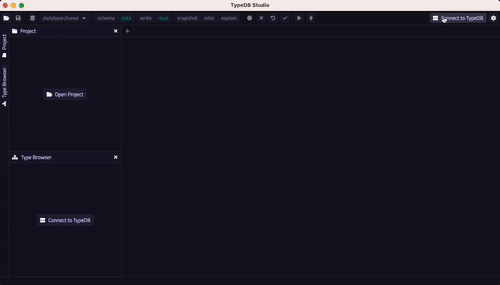
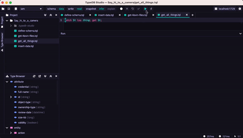

[](https://typedb.com/docs/typedb/connecting/studio)

[](https://factory.vaticle.com/typedb/typedb-studio)
[](https://github.com/typedb/typedb-studio/releases/latest)
[](https://typedb.com/discord)
[](https://forum.typedb.com)
[](https://stackoverflow.com/questions/tagged/typedb)
[](https://stackoverflow.com/questions/tagged/typeql)

# Introducing TypeDB Studio

TypeDB Studio is the IDE for developing with **[TypeDB](https://github.com/typedb/typedb)**. It provides a consistent experience across different environments, including macOS, Linux, and Windows. With Studio, developers can easily manage databases, execute queries, and explore query results, all within a unified interface.

- [Install TypeDB Studio](https://typedb.com/docs/home/install/studio)
- For a quick overview, check out the [relevant lesson](https://typedb.com/docs/learn/2-environment-setup/2.2-using-typedb-studio) in our end-to-end [TypeDB Learning Course](https://typedb.com/docs/learn/overview).
- For an in-depth guide to TypeDB Studio, check out the [manual](https://typedb.com/docs/manual/studio).
- Discover more of TypeDB’s unique [features](https://typedb.com/features).


[](./docs/images/create.gif)

## Features

### GUI for data modeling

On top of the ability to model your data with TypeQL,
TypeDB Studio includes a type browser and a type editor with a graphical user interface,
making it convenient to edit, visualize, and maintain data models.
The user-friendly interface simplifies the process of creating, extending, exploring, and managing schemas,
enabling developers to easily define the structure and relationships of their data.

[](./docs/images/edit.gif)

### Data and schema visualization

One of the key features of TypeDB Studio is its interactive visualizer, 
which allows developers to visualize query results and explore inferred data.
The visualizer presents data in a hypergraph format,
making it easy to navigate and visualize TypeDB responses.

[](./docs/images/query.gif)

### Fully-fledged IDE for developing with TypeDB

TypeDB Studio covers all steps of the development process with TypeDB:

- Graphical user interface for connecting to TypeDB without the use of command line tools, libraries, or Driver API.
- Database manager to create and delete databases.
- Type browser for exploring type hierarchy of a database's schema.
- Type editor for adjusting existing types in a database.
- Project file management to store your favorite queries.
- Convenient multi-tab query editor with TypeQL syntax highlighting, auto-saving, query execution, response output, 
  and pop-up notifications for warnings and error messages that may occur during runtime/query execution.
- Graph visualization engine for visualizing query results using user-modifiable, force-directed graph drawings.
- Local syntax validation before sending instructions and queries to the server.
- Automatic transaction management with full GUI control, including read/write transactions, schema/data sessions, as 
  well as transaction control (commit/rollback/close) and transaction options.
- Rule-based inference enabled with a click of a button (`infer`).
- Explanations visualization displays the deductive reasoning behind inferred data for root cause analysis.

## Download TypeDB Studio

You can download TypeDB Studio from the [GitHub Releases](https://github.com/typedb/typedb-studio/releases) page.
For more information on how to install and run TypeDB Studio, see the 
[Installation guide](https://typedb.com/docs/home/install#_studio).

## Compile from source

> Note: You **DO NOT NEED** to compile TypeDB Studio from source if you just want to use TypeDB Studio.
> You can simply download TypeDB Studio following the _"Download TypeDB Studio"_ section above.

1. Make sure you have the following dependencies installed on your machine:
    - Java JDK 11 or higher
    - [Bazel 6 or higher](https://bazel.build/install).
 
2. You can build TypeDB with either one of the following commands, depending on the targeted architecture and 
   operating system: 
   ```sh
   $ bazel run //:studio-bin-mac-arm64
   $ bazel run //:studio-bin-mac-x86_64
   ```
   ```sh
   $ bazel run //:studio-bin-windows-x86_64
   ```
   ```sh
   $ bazel run //:studio-bin-linux-arm64
   $ bazel run //:studio-bin-linux-x86_64
   ```
   You can also replace `run` with `build` in the command above, and Bazel will simply produce the JAR for TypeDB Studio
   under `bazel-bin/studio-bin-mac-x86_64.jar` or similar directory, with respect to the chosen OS and architecture.

## Useful links

If you want to begin your journey with TypeDB, you can explore the following resources:

* In-depth dive into TypeDB's [philosophy](https://typedb.com/philosophy)
* Our [TypeDB quickstart](https://typedb.com/docs/typedb/quickstart-guide)
* Our [TypeDB Studio documentation](https://typedb.com/docs/clients/studio)
* **[TypeQL](https://github.com/typedb/typeql)**
* **[TypeDB](https://github.com/typedb/typedb)**

## Contributions

TypeDB Studio has been built using various open-source frameworks, technologies and communities throughout its 
evolution. Today TypeDB Studio is built
using [Kotlin](https://kotlinlang.org),
[Compose Multiplatform](https://github.com/JetBrains/compose-jb),
and [Bazel](https://bazel.build).

Thank you!

## Licensing

This software is released under the Mozilla Public License 2.0 (MPL 2.0).
For license information, please see [LICENSE](https://github.com/typedb/typedb-studio/blob/master/LICENSE). 
