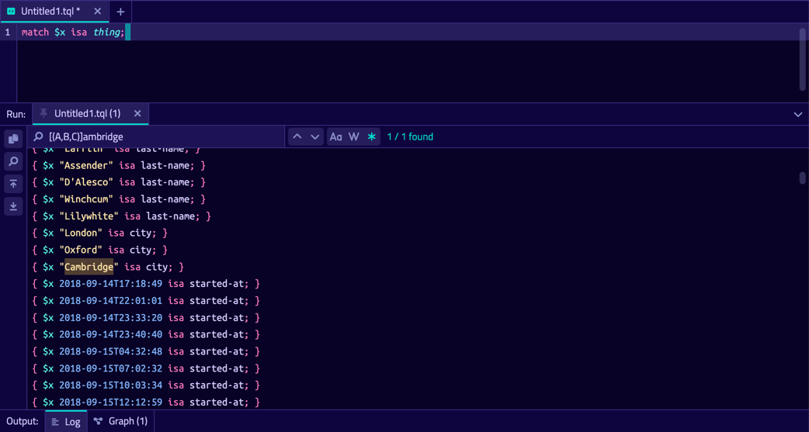

## TypeDB Studio

TypeDB Studio is TypeDB's Integrated Development Environment to perform knowledge engineering.

You can utilise Studio like [TypeDB Console](https://docs.vaticle.com/docs/console/console)
and [TypeDB Clients](https://docs.vaticle.com/docs/client-api/overview), to connect to your TypeDB instance and perform
queries.

Studio is an IDE designed for the end-to-end development of TypeDB databases, database queries, and data exploration, 
via a clean and intuitive UI.

## Download & Install
TypeDB Studio is available for Linux, Mac and Windows. Head over to the 
[releases](https://github.com/vaticle/typedb-studio/releases) page to download and install the latest release of Studio.

## Usage
Upon launching Studio, you'll be asked for your TypeDB server details and to choose or create a database. Studio makes
these choices explicit so that it's always clear what you're working on at any given time.

### Manage TypeDB Projects

After connecting to TypeDB and selecting a database, Studio will prompt you to open (or create) a project directory. 
This is where Studio will load and save query files, but we can also freely edit text files in the project directory 
using Studio. The project browser maintains a live view of the directory contents on the filesystem, much like other 
major IDEs do.

### Manage Database Schemas

The Type Browser provides a structured tree view of the connected database's type hierarchy. Opening any Type will 
bring up a page that lists in detail its properties - supertype, roles played, attributes owned, etc.

### Run TypeQL Queries

Studio sports a fully-featured, performant text editor including all the functionality one would expect from an editor 
(Undo/Redo, Find/Replace, etc.) It also includes syntax highlighting for TypeQL files (\*.tql). Studio's intuitive and 
self-explanatory interface enables a rapid, iterative workflow.

TypeDB Studio brings session and transaction configuration to the forefront, providing greater visibility to the user 
about the state of the system; and crucially, allows for the running of any kind of TypeQL Query - Define, Insert, 
Match Aggregate, and so on, which was not possible in previous iterations of Studio. The results of these queries are 
printed to a Log Output window, which also features TypeQL syntax highlighting and fully-featured search.

### Graph Visualisation

Reasoning about text outputs in [TypeDB Console](https://docs.vaticle.com/docs/console/console) or through
the various [TypeDB Clients](https://docs.vaticle.com/docs/client-api/overview) can be difficult to do for large
datasets. Studio's advanced force-graph visualisation makes the underlying structure of data immediately apparent.

### Reasoning and Explanations

Select infer and explain, then double-click highlighted inferred concepts to retrieve their explanations and visualise
how the fact was inferred.